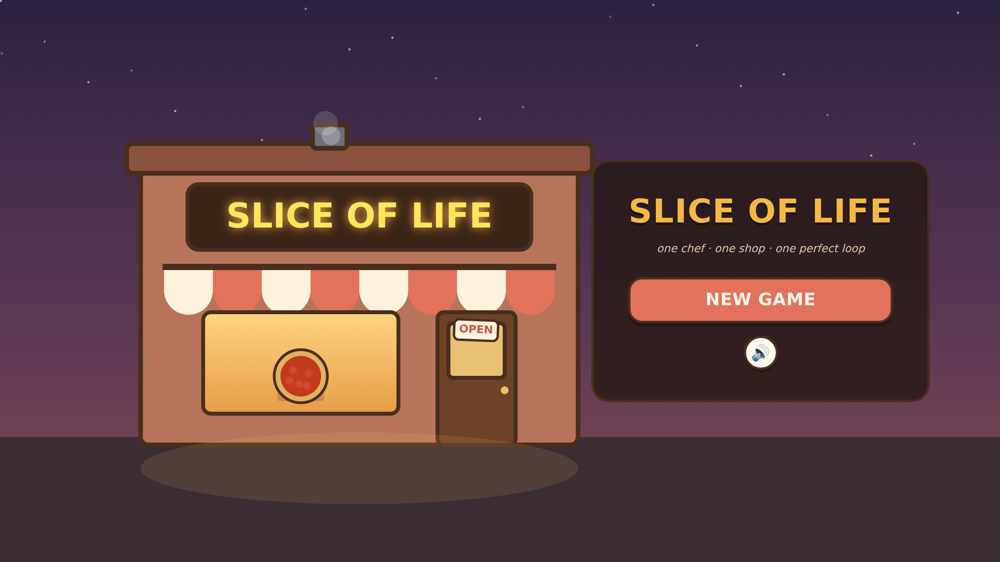
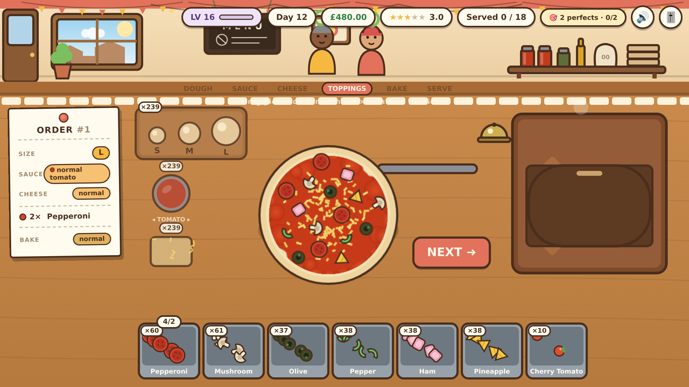
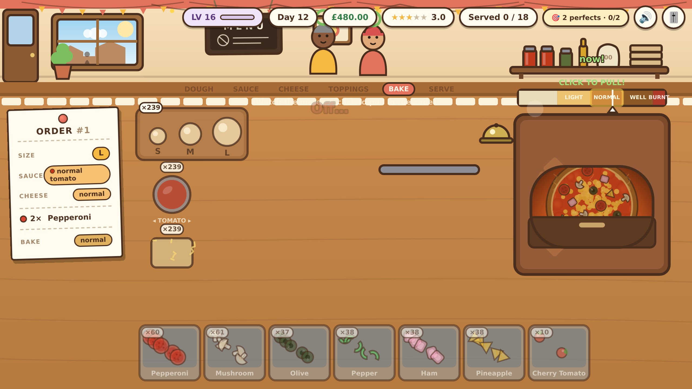
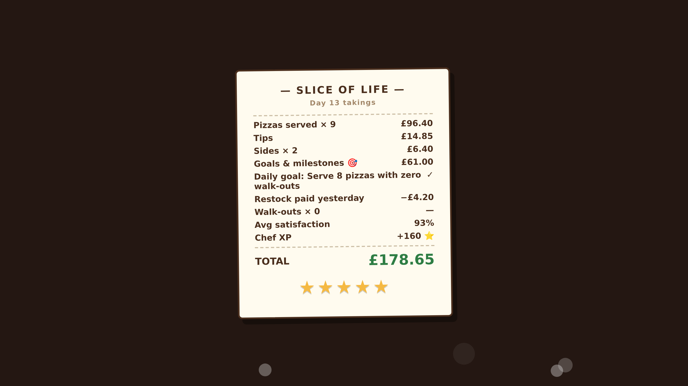
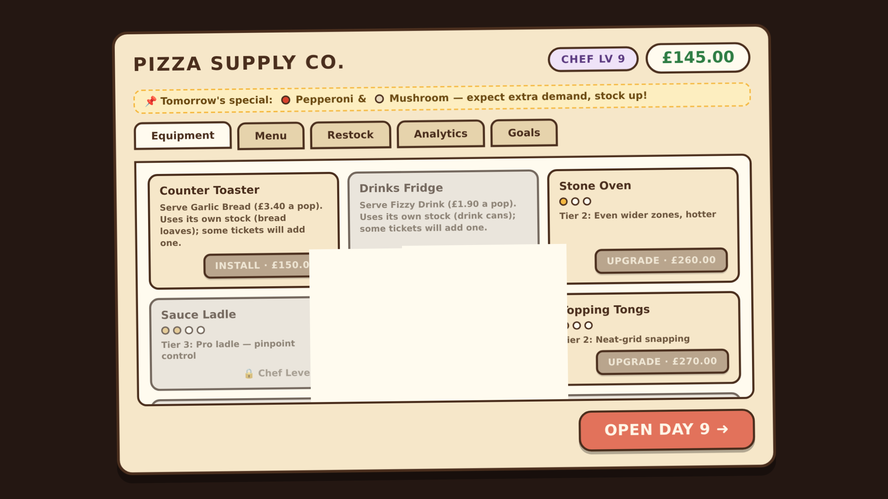
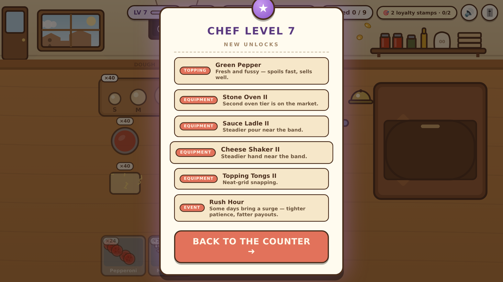

# 🍕 Slice of Life

*One chef. One shop. One perfect loop.*

## ▶ [**PLAY NOW**](https://masked-brown.github.io/slice-of-life/)



## What is this

A first-person pizza shop game, built solo, no dependencies. You're the chef:
read the ticket, build the pizza by hand, bake it, ring the bell. Every order
pays cash *and* Chef XP — leveling up is what unlocks new toppings, recipes,
equipment and events, one idea at a time. Run the shop long enough and you
stop being the one making every pizza and start being the one running the
place: automation, loyal regulars, a menu of specialties, and a business that
has to survive its own supply chain.

## Features

- **Hand-built pizza stations** — dough, hold-to-pour sauce & cheese with
  live band gauges, drag-on toppings, oven bake zones, a sides bench for
  garlic bread and drinks
- **Chef XP & leveling** — 30 levels on a declarative unlock table; every
  topping, recipe, upgrade and event opens through play, not a paywall
- **Stock & spoilage economy** — every ingredient is bought by the unit and
  ages; supplier grades (budget/standard/premium) trade delight against
  shelf life, and the analytics tab shows exactly what waste is costing you
- **Specialty pizzas & recipe mastery** — named recipes that earn stars (and
  a bigger price tag) the more perfectly you repeat them
- **Loyalty cards** — regulars you nail orders for stamp a card, climb
  tiers, tip better, and eventually bring friends
- **Automation arc** — proofer, auto-dispenser, cheese hopper, a second
  oven and a ticket rail turn the late game from executor into orchestrator
- **Events & a 36-day seasonal calendar** — rush hours, food critics,
  supply shortages, festivals, health inspections, rotating seasonal
  toppings — always announced a day ahead, never a surprise
- **Milestones & daily goals** — lifetime milestones plus a rotating daily
  goal with its own payout
- **Generative, mood-aware audio** — the soundtrack reads the room (rush
  days run faster, critic days run tenser); every sound, including the
  music, is synthesized in code — zero audio files
- **Zero dependencies** — vanilla JS/HTML/CSS, Canvas + Web Audio, no
  frameworks, no build step, no external assets of any kind

## Screenshots

| | |
|---|---|
|  *Build stations — hold-to-pour sauce & cheese, drag-on toppings* |  *The oven — bake zones, pull it at the right moment* |
|  *Day-end receipt — the tally, then the stars* |  *The shop — equipment, menu, restock, analytics, goals* |
|  *A level-up reveal — new unlocks, one idea at a time* | |

## Run it locally

Any static file server works. From this folder:

```bash
python3 -m http.server 8000
```

Then open **http://localhost:8000** in a desktop browser (Chrome/Firefox/Edge).
Mouse-first; pointer events mean touch mostly works too.

> ES modules don't load from `file://` — you do need the local server.

## Tech stack

Vanilla JS/HTML/CSS (ES modules), Canvas + Web Audio — no frameworks, no
build step, no dependencies.

## How to play

Each day starts with the **day-start board**: the season, today's event
(never a surprise), specials, the daily goal, phone pre-order offers, and a
stock check. Then customers queue along the top. The front customer's
**ticket pins to the left**. Build left to right:

| Station | Control |
|---|---|
| **Dough** | Click the S / M / L ball (crust chips above the tray once unlocked; the Proofer makes it one click) |
| **Sauce** | Click the pot to switch base (tomato/BBQ/white), then press & **hold** over the pizza — release inside the ticket's band |
| **Cheese** | Same: **hold** to sprinkle, release in the band |
| **Toppings** | Drag pieces from the bins. Counts matter exactly; half-and-half tickets score each side |
| **Sides** | Some tickets add garlic bread or a drink — the bench under the oven, same hold-release skill |
| **Oven** | Slide it in, pull in the ticket's zone. The **Second Oven** lets you take the next order while one bakes |
| **Serve** | Ring the **bell** |

**Chef XP & levels**: every order pays XP scaled hard by accuracy. Levels
unlock everything — toppings, recipes, sides, events, order types, equipment
— one new idea at a time (the reveal card shows what just opened). Money
still does the buying.

**Stock & spoilage**: every ingredient (including dough, sauce base and
mozzarella) is bought by the unit and **ages**. Fresh things keep 2–3 days,
cured things longer — the restock screen shows shelf lives and what expires
tonight. Overbuying is money in the bin; the analytics tab shows the damage.
Run a basic dry mid-service and the corner shop covers you at a markup.

**Supplier grades**: budget / standard / premium for cheese, sauce and the
flagship toppings. Premium delights customers and spoils faster; analytics
tells you whether it's paying for itself at your volume.

**Specialties & mastery**: named recipes at a premium once unlocked.
Perfect them repeatedly and they earn stars that raise their price.

**Regulars & loyalty**: nail a regular's order (85%+) to stamp their card —
tiers make them visit more, tip better, and eventually bring friends.

**Events**: rush hours, food critics, supply shortages, festivals, slow
mornings, health inspections, Nonna, surprise deliveries — always announced
the evening before, each with an end-of-day report line.

**Seasons**: a rolling 36-day year. Each season lends 1–2 rotating toppings
and a seasonal specialty, reskins the window, and biases the events. It all
cycles back — nothing is missable.

**Pre-orders**: accept known tickets at day start for +25%; they arrive at
fixed points and lateness stings. The due strip lives under the HUD.

**Patience**: every queued customer has a draining ring; impatient types
drain fast, easy-going slow, VIPs pay big but won't wait. No game over,
just a worse day.

At day end: receipt (waste and corner-shop lines included) → analytics →
shop (Equipment / Menu / Restock / Analytics / Goals) → day board → next
day. Auto-saves at end of day; **V1 and V2 saves migrate automatically**.

## For playtesters

**Ctrl+Shift+D** opens the telemetry dev panel (local only, no network, no
PII): summary stats and an **EXPORT JSON** button. Send exports per
`feedback/README.md`.

## Structure

```
index.html
styles.css            UI chrome: HUD, ticket, receipt, shop, board, analytics
src/
  main.js             boot, rAF loop, scenes, input, scaling, audio settings
  state.js            state + save/load/migration + stock batches (spoilage)
  balance.js          EVERY tunable number — including the level/unlock table
  progress.js         XP, levels, unlock queries, reveal card, loyalty, mastery
  goals.js            milestones, daily goals, next-day plan (specials/event/pre-orders)
  events.js           day-event scheduler (pity timer, season weighting)
  seasons.js          the 36-day year, rotating toppings
  analytics.js        the per-ingredient P&L panel (waste, grades, sides)
  telemetry.js        local ring buffer + dev panel + JSON export
  music.js            generative background music (mood-aware)
  juice.js            tween utility, particles, screen shake, floating text
  audio.js            Web Audio synth SFX (zero audio files)
  scenes/
    title.js  service.js  dayEnd.js  shop.js
  stations/
    order.js          queue, tickets, archetypes, regulars, patience, rail
    build.js          dough/crusts, sauces, cheese, toppings, automation
    oven.js           bake meters, zones, second-oven slots & alarms
    sides.js          garlic bread & drinks bench
    serve.js          scoring + the serve/payout sequence
tools/
  logic-test.mjs      headless assertions over the pure game logic
  economy-sim.mjs     30-day full-system economy simulation (tuning instrument)
  smoke-test.mjs      Playwright: 4 scenarios in real Chromium
docs/                 design docs & plans        DESIGN_NOTES.md  the V3 design record
feedback/             where playtest telemetry + notes get filed
```

```bash
node tools/logic-test.mjs     # pure-logic checks (~90 assertions)
node tools/economy-sim.mjs    # 30-day economy table + target scorecard
node tools/smoke-test.mjs     # 4 browser scenarios, 67 checks
```

All balance lives in `src/balance.js` with comments. No magic numbers in
gameplay code.

---

© 2026 Masked-Brown. Source visible for portfolio/demo purposes; all rights
reserved.
